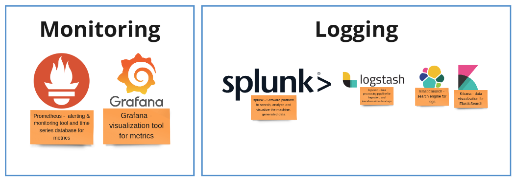

# Portal IAM - Workshop 27th September, 2023

## Overview

## Current Setup

### Overall System Diagram


Portal IdP is formed by two Keycloak instances:

* Central IdP
    * One single realm (CX-Realm)
    * An Identity Provider per realm in Shared IdP
    * A client per application integrated
* Shared IdP
    * User management


The high level Auth/Authz workflow is:

1. Central IdP centralizes the Authorization and Authentication workflows.
There is one single realm with multiple Identity Providers (Identify Federation) Each IP is a realm defined in the Shared IdP
OIDC protocol
2. Shared IdP authenticates users from the different realms and sources defined.
Each user is imported finally in the single realm of Central IdP with limited information
3. Authorization policies are declared in Central IdP
Clients are defined in the single realm of the Central IdP
4. User gets its final token from Central IdP and uses it by the portal for its business workflow.

### Deployment Topology

* Two deployments based on [Helm Charts](https://artifacthub.io/packages/helm/bitnami/keycloak) provided by Bitnami:
    * [Central IdP Helm Chart](https://github.com/eclipse-tractusx/portal-iam/tree/v1.2.0/charts/centralidp)
    * [Shared IdP Helm Chart](https://github.com/eclipse-tractusx/portal-iam/tree/v1.2.0/charts/sharedidp)
* Deploy on Kubernetes platforms
* Managed by ArgoCD following a GitOps approach
* Fully automated, including Keycloak configuration, realms management, and user management
    * Kubernetes Job for seeding configuration (CX-Realm) into Central IdP
    * Seeding Job is a custom .Net application to update Keycloak using the REST API

### Findings Summary

* Splitting responsibilities (Auth, Authz) across different Keycloak instances ✅
* Enables to scale and adapt the deployment topology with a low effort ✅
* Enables to break the limit of number of realms in Keycloak (WildFly version) ☑️
* Seeding job using REST API ✅
    * Updating Database directly is not recommended and it could be the root cause of issues 🚩
* Using Kubernetes models (GitOps) and tools (Helm Charts)☑️
* Metrics, monitoring and observability 🔲
* Performance or capacity plan 🔲
* Documentation 🔲

## Improvements

### Shared IdP - Number of Realms

* Not hard-limit defined
* Recommended to have maximum 100 realms per Keycloak instance
* This limit depends of multiple factors (Hardware, CPU, memory, loads, etc.)
    * Require some testing to identify the limit per deployment
* Deploy more Keycloak instances is the common practice to break this limit and scale
    * More Shared IdP deployments to manage more realms
    * Define each Shared IdP per companies, teams, regions, …
    * Not break the current topology of Central IdP and Shared IdP
* A lot of efforts done by the Keycloak community to improve it in future versions
    Using a new storage layer: [Keycloak X - Storage - High-level architecture](https://github.com/keycloak/keycloak-community/blob/main/design/keycloak.x/storage-architecture.md)
* References:
    * [Why is the RH-SSO admin UI very slow when using about 300+ realms?](https://access.redhat.com/solutions/2969291)

### Helm Charts

* Provided by a 3-party community not supported by Keycloak community:
    * Delay between new Keycloak and new Helm Chart versions
    * Not aligned with Keycloak roadmap -> Keycloak Operator
* Two custom implementations very similar (Central IdP, Shared IdP)
    * Same files in different charts: secret-postgres-init.yaml, secret-external-db.yaml
    * Different files, same content: secret-centralidp.yaml, secret-sharedidp.yaml
    * Unique files based on layout: job-seeding.yaml, secret-sharedidp-realms.yaml
* Use best practices creating one single Helm Chart for Portal IAM
    * Declare a variable to identify the layout (central, shared) -> Customize the layout
    * Everything in a single place -> Chart definition, templates, and common values
    * Documentation centralized avoiding content duplication and reducing efforts of maintenance
* Using different values.yaml file per each instance outside of Helm Chart
    * Integrated with ArgoCD applications definitions to operate the final platform


### Metrics, Monitoring and Observability

* No references about how to monitor the application -> Key in a central component of any system
* Without metrics we can’t verify the right behavior and performance of our system
* Any application on a Kubernetes platform must expose the status of the application
    * [liveness and readiness probes](https://kubernetes.io/docs/tasks/configure-pod-container/configure-liveness-readiness-startup-probes/)
    * Helm Chart includes livenessProbe and readinessProbe variables
* Keycloak Metrics are exposed as Prometheus text format
* Many different tools in the Kubernetes space
    * Not all of them integrated, depending on the running platform
    * Red Hat OpenShift provides a full [monitor](https://access.redhat.com/documentation/en-us/openshift_container_platform/4.12/html-single/monitoring/index) and [logging](https://docs.openshift.com/container-platform/4.12/logging/cluster-logging.html) stack
References:
    * [Enabling Keycloak Health checks](https://www.keycloak.org/server/health)
    * [Enabling Keycloak Metrics](https://www.keycloak.org/server/configuration-metrics)



### Performance or Capacity Plan

* Portal IAM is a central component of the solution, performance is key for success
* No sizing references in the documentation
    * Replica Count 3 (enabling High-Availability), however why that number?
    * Sizing guidance can be much appreciated
* Readers don’t have references about setting up the resources (cpu, memory)
* Keycloak instances based on Wildfly can follow the common performance practices:
    * https://www.mastertheboss.com/jbossas/jboss-performance/jboss-performance-tuning-part-1/
    * https://access.redhat.com/documentation/en-us/red_hat_jboss_enterprise_application_platform/7.4/html-single/performance_tuning_guide/index
* Helm Charts provides the `resources.limits` and `resources.requests` variables for Keycloak containers
* References:
    * [Capacity planning, Sizing guide, Performance Tuning or Benchmarks for RH-SSO](https://access.redhat.com/solutions/3217681)

### Documentation

* Few references or links to Keycloak concepts or guides
* Readers don’t have a clear understanding about the activities
* Install or upgrade tutorials include steps to execute in Keycloak without a clear context
* Good to add screenshots or links to Keycloak Documentation to give context
* [Keycloak Documentation](https://www.keycloak.org/documentation) has a lot of good resources explaining the concepts used in Portal IAM
* Missed how to integrate Portal IAM and ArgoCD
    * Benefits and How-to tutorials
    * Application and Environments definitions
    * Application Life cycle

## Update Procedure

### Release Notes

* [17.0.0 - Quarkus Distribution](https://www.keycloak.org/docs/latest/release_notes/index.html#keycloak-17-0-0)
    - Quarkus is a framework to build applications
    - `/auth` removed from default context path
    - New operator and CRDs for Kubernetes
* [18.0.0 - New Keycloak Operator](https://www.keycloak.org/docs/latest/release_notes/index.html#keycloak-18-0-0)
    - Operator uses the Keycloak distribution of Quarkus
    - New Admin console preview
    - Base of Red Hat Single Sign-On 7.6
* [19.0.0 - New Admin Console graduated](https://www.keycloak.org/docs/latest/release_notes/index.html#keycloak-19-0-0)
    - Old console admin is deprecated
    - OpenID Connect and SAML Adapters EOL
    - New Keycloak storage
    - Initial support for centralized logging
* [20.0.0 - WildFly distribution removed](https://www.keycloak.org/docs/latest/release_notes/index.html#keycloak-20-0-0)
    - Keycloak Operator is GA
    - OpenJDK 17 supported
* [21.0.0 - Removing old things](https://www.keycloak.org/docs/latest/release_notes/index.html#keycloak-21-0-0)
    - Old Admin console
    - Java 11 deprecated
    - Hashicorp Vault no longer supported
    - Deprecated methods from user  session provider
* [21.1.X - Keycloak is a monorepo](https://www.keycloak.org/docs/latest/release_notes/index.html#keycloak-21-1-2)
    - https://github.com/keycloak/keycloak
    - Experimental Account Console v3
    - Changes in validating schemes from valid redirect URIs (deprecated since 12.x and now removed)
    - Custom themes using old admin console won’t work
* [22.0.0 - Latest Mayor version](https://www.keycloak.org/docs/latest/release_notes/index.html#keycloak-22-0-0)
    - Transition from Java EE to Jakarta EE (javax.* -> jakarta.*)
    - Java 11 removed
    - Upgrade to Quarkus 3.X
    - Upgrade to Hibernate ORM 6
    - Base of Red Hat Build of Keycloak (RHBK)
* [22.0.X - Improvements](https://www.keycloak.org/docs/latest/release_notes/index.html#keycloak-22-0-3)
    - LDAP and Kerberos integration
    - Bugs fixed

### Deprecations and Deletions

* The `/auth` path is removed from default context path ([migration guide topic](https://www.keycloak.org/migration/migrating-to-quarkus#_default_context_path_changed))
* Old Console Admin are removed and not longer valid
* OpenID Connect and SAML Adapters are marked as EOL (no longer distributed)
* Java 11 is removed. OpenJDK 17 is the new supported runtime
* Hashicorp Vault no longer supported
* Many changes in REST API and deprecated many different methods

### Migration and Upgrade Overview

* Quarkus distribution introduces a number of breaking changes 🚨
    * Not longer running on an Application Server (uber-jar file)
    * [Migration Guide](https://www.keycloak.org/migration/migrating-to-quarkus) helps to move to the new distribution
    * [Upgrading Guide](https://www.keycloak.org/docs/latest/upgrading/index.html) helps to upgrade from previous versions
* Main changes ✨
    * New container images from [Quay.io registry](https://quay.io/organization/keycloak) ([upgrading guide topic](https://www.keycloak.org/docs/latest/upgrading/index.html#default-distribution-is-now-powered-by-quarkus))
    * The `/auth` path is removed from default context path ([migration guide topic](https://www.keycloak.org/migration/migrating-to-quarkus#_default_context_path_changed))
    * Custom providers, and themes are packaged and deployed differently
    * Configuration model not longer on jboss-cli tool. Single file `conf/quarkus.properties` 
    * Initial users managed by environment variables ([migration guide topic](https://www.keycloak.org/migration/migrating-to-quarkus#_setup_of_initial_users)) instead of shell scripts
    * Migration available using the Keycloak Operator -> Requires a new deployment
    * New Health Checks endpoints to monitor Keycloak ([upgrading guide topic](https://www.keycloak.org/docs/22.0.3/upgrading/#potentially-breaking-changes-to-the-health-endpoints))
    * Changes in UserInfo endpoints ([upgrading guide topic](https://www.keycloak.org/docs/latest/upgrading/index.html#userinfo-endpoint-changes))
    * Many other changes for developers ([upgrading guide topic](https://www.keycloak.org/docs/22.0.3/upgrading/#changes-affecting-developers))

### Upgrading Guide - Keycloak Approach

* Upgrade first Keycloak server instances, Keycloak adapters second
* Backup existing database before upgrade 🔝
* The database will no longer be compatible with the old server after the upgrade 🚩
    * Rollback requires to restore database before starting previous version
* Keycloak can automatically migrate the database schema
    * Migration starts when the new installation is executed for the first time
* Themes should work in the new version

### Upgrading Guide - Kubernetes Approach

* Many changes to keep in mind, something can go wrong 🙈
* Updating real databases with traffic can be tricky and requires a good coordination
    * Stop old Keycloak services
    * Backup database
    * Deploy new Keycloak services
* Use Kubernetes Advanced deployment methods to upgrade the service with less impact
* These advance deployment methods allow a fast rollback in case of emergency or fatal error
    * Blue/Green Deployment
    * Canary Deployment
* Both methods require new instances of Database for new services using the latest versions

#### Blue/Green Deployment

* Involve running two versions of an application at the same time
* Moving from the in-production version (green) to the newer version (blue)
* Traffic is switched from one to the other when confidence is achieved
* [Reference](https://martinfowler.com/bliki/BlueGreenDeployment.html)


#### Canary Deployment

* Miners used to bring a small bird (like a canary) into the mines
* Birds are extremely sensitive to hazardous materials (like carbon monoxide)
* If bird passed out; miners knew to get out

* Route some traffic to new version
* Use monitoring and metrics to detect variation from control
    * Has the canary app passed out?
* Stop rollout and remove the canary version if variation detected
* [Reference](https://martinfowler.com/bliki/CanaryRelease.html)


#### Database services during change over

* Each Keycloak instance will use its own database instance
* Isolate changes, conflicts and allow rollback between versions easily
* Required as we can’t use the same database schema for different versions
* Useful to use new DB versions (e.g: PostgreSQL 15)
* [Reference](https://www.keycloak.org/server/db)


## New Features

### Keycloak and Quarkus

* Refactor of Keycloak moving from WildFly (Application Server) to Quarkus (Java Framework)
* Movement done to align with the new practices and development life cycle in cloud environments
* Main benefits
    * Focus on usability with a better experience to configure and start the server
    * Smaller distribution with a significant reduction in server startup time, memory footprint (low RSS) and better runtime performance through Vert.x
    * Container-First and Cloud-Native distribution
    * Increased Developer Experience provided by the Quarkus rich ecosystem


* Unified the best of Kubernetes and Java in one single place
* Developer experience with a cohesive platform providing:
    * Live coding, unified configuration, unifies Imperative and Reactive, huge community, …
* Best of breed frameworks and standards
    * Don’t need to learn new technologies


* [Reference](https://quarkus.io/)

#### Container First


### Keycloak Operator

* Recommended (and supported) way to operate Keycloak instances on Kubernetes environments
    * Promoted and maintained by the Keycloak Community
* Based on [Operator Pattern of Kubernetes](https://kubernetes.io/docs/concepts/extend-kubernetes/operator/)
* Available at OperatorHub.io as [Keycloak Operator](https://operatorhub.io/operator/keycloak-operator) (Phase 4 - Deep Insights)
* Aligned with each Keycloak instance (same release cadence)
* [Reference](https://www.keycloak.org/operator/installation)


#### Kubernetes Operators

* Application-specific controller is used to create, configure and manage other complex application:
    * The controller contains specific domain/application knowledge
    * Usually used for stateful application (e.g: databases) which are non-trivial to operate on Kubernetes
* Controller operates based on input from Config Maps or Custom Resource Definitions
    * User describes the desired state
    * Controller applies that state to the application


#### Operator Pattern

* Monitor the current state of the application
* Compare the actual state to the desire state
* Resolve any differences between actual and desired state


#### Custom Resource Definitions

* `Keycloak`:
    * Represents a Keycloak instance
    * Requires a database, hostname and TLS certificate
    * [Specification](https://github.com/keycloak/keycloak/blob/main/operator/src/main/java/org/keycloak/operator/crds/v2alpha1/deployment/KeycloakSpec.java)

```yaml
apiVersion: k8s.keycloak.org/v2alpha1
kind: Keycloak
metadata:
  name: central-idp
spec:
  instances: 3
  db:
    vendor: postgres
    host: centralidp-postgresql-external-db
    usernameSecret:
      name: centralidp-postgres
      key: username
    passwordSecret:
      name: centralidp-postgres
      key: password
  hostname:
    hostname: centralidp.example.org
```

* `KeycloakRealmImport`
    * Represents a Realm and all its configuration
    * Users and Clients are part of this resource
    * [Specification](https://github.com/keycloak/keycloak/blob/main/operator/src/main/java/org/keycloak/operator/crds/v2alpha1/realmimport/KeycloakRealmImport.java)

```yaml
---
apiVersion: k8s.keycloak.org/v2alpha1
kind: KeycloakRealmImport
metadata:
  name: cx-central
spec:
  keycloakCRName: central-idp
  realm:
    id: CX-Central
    realm: CX-Central
    displayName: Catena-X Central
    enabled: true
```

Requested by a [Pull Request](https://github.com/keycloak/keycloak-quickstarts/issues/492) a new [Keycloak Quickstart](https://github.com/keycloak/keycloak-quickstarts) to introduce the Keycloak Operator to new users.

* References:
    * [Basic Keycloak deployment](https://www.keycloak.org/operator/basic-deployment)
    * [Keycloak Realm Import](https://www.keycloak.org/operator/realm-import)

## References

### Keycloak References

* [GitHub Keycloak monorepo](https://github.com/keycloak/keycloak)
* [Keycloak Site](https://www.keycloak.org/)
* [Keycloak Documentation](https://www.keycloak.org/documentation)
* [Keycloak Guides](https://www.keycloak.org/guides)
* [Keycloak Admin REST API](https://www.keycloak.org/docs-api/22.0.3/rest-api/index.html)
* [Keycloak Quickstarts](https://github.com/keycloak/keycloak-quickstarts)

### Red Hat Single Sign-On References

* [Red Hat Single Sign-On Component Details](https://access.redhat.com/articles/2342881)
* [Red Hat Single Sign-On Supported Configurations](https://access.redhat.com/articles/2342861)
* [Red Hat Single Sign-On Release History](https://access.redhat.com/solutions/3296901)
* [Red Hat Build of Keycloak - Issues Tracker](https://issues.redhat.com/projects/RHBK/issues/?filter=allopenissues)
